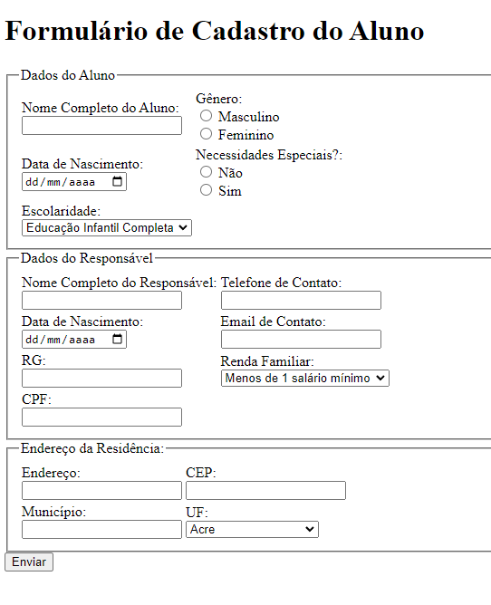
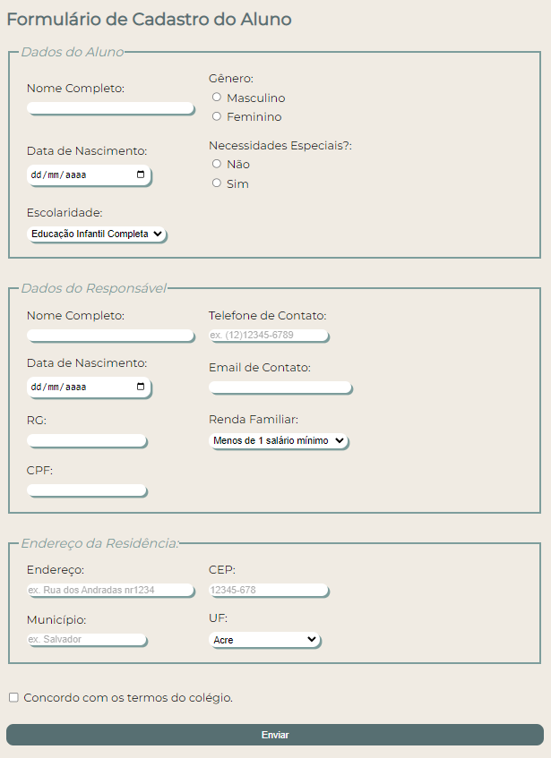

<h1 align="center">Formulário HTML5</h1>

 

<h3>Formulário em HTML:<h3>

<kbd>

 

<h3>Formulário em HTML E CSS:<h3>

<kbd>

 

>Exercício

Projeto de construção de um formulário primeiramente em HTML, e posteriormente estilizando com CSS.  

[Clique aqui para acessar o site.](https://scgui.github.io/formulario)

## 🔧 Tecnologias

- HTML
- CSS
- Git e Github

## O que aprendi

- Relembrar e treinar conceitos de HTML, principalmente Input e seus subconjuntos.
- A necessidade de me atendar aos detalhes da estilização, por exemplo box-shadow e a opacidade do placeholder dentro do Input de texto. 

## 🔌 Contato

guics37.go@gmail.com
